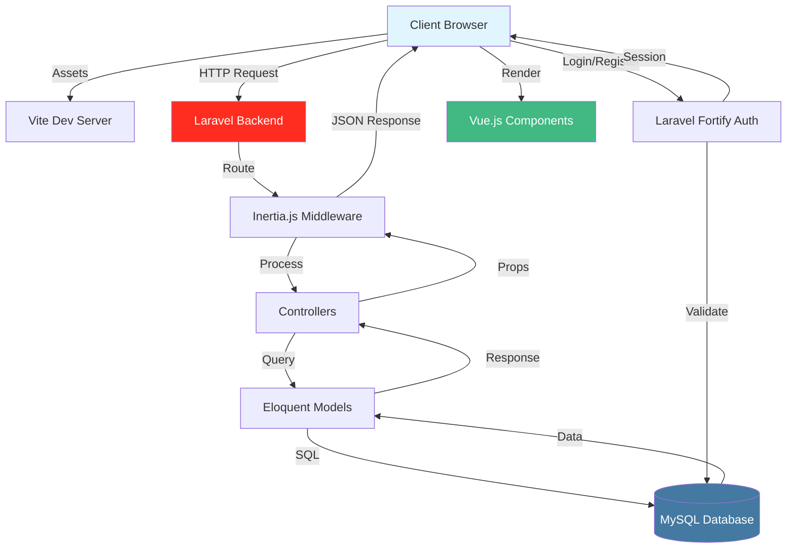
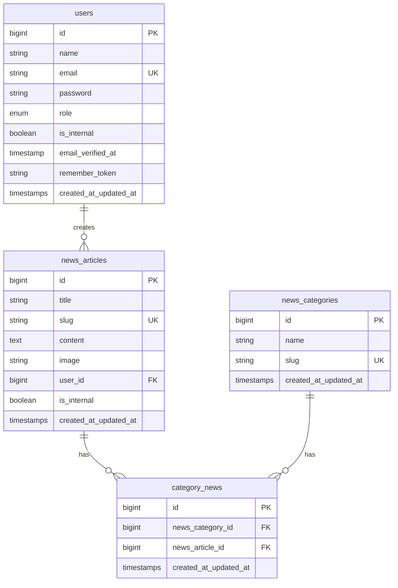
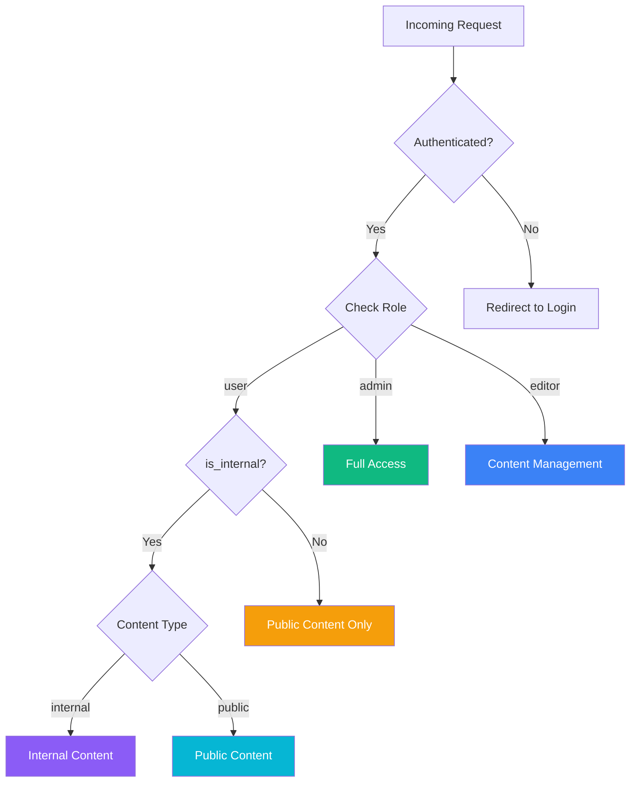

# NPS News System


A modern fullstack news management system built with Laravel and Vue.js, featuring role-based access control and internal/external news management. This system provides a comprehensive platform for managing news articles with categorization, user roles, and visibility controls.

## Table of Contents

- [Overview](#overview)
- [Key Features](#key-features)
- [Tech Stack](#tech-stack)
- [System Architecture](#system-architecture)
- [Database Schema](#database-schema)
- [Role & Permissions](#role--permissions)
- [Features by Role](#features-by-role)
- [Project Structure](#project-structure)
- [Installation](#installation)
- [Development](#development)
- [Testing](#testing)

## Overview

NPS News System is a comprehensive news management platform designed to handle both internal and external news distribution. The system implements a robust role-based access control mechanism, allowing different levels of access and functionality based on user roles.

The application separates news visibility into internal and external content, enabling organizations to manage company-wide announcements alongside public-facing news articles. With its modern tech stack and intuitive interface, the system provides a seamless experience for content creators, editors, and administrators.

## Key Features

- Role-based access control with three distinct user levels
- Internal and external news management
- News categorization and tagging system
- Article management with CRUD operations
- User authentication and authorization
- Two-factor authentication support
- Responsive design with modern UI components
- Real-time updates using Inertia.js
- SEO-friendly URLs with slug-based routing
- Image upload and management for articles

## Tech Stack

### Backend

| Technology | Version | Purpose |
|------------|---------|---------|
| PHP | ^8.2 | Server-side programming language |
| Laravel | ^12.0 | PHP web application framework |
| Laravel Fortify | ^1.30 | Authentication and user management |
| Laravel Tinker | ^2.10 | Interactive REPL for Laravel |

### Frontend

| Technology | Version | Purpose |
|------------|---------|---------|
| Vue.js | ^3.5.13 | Progressive JavaScript framework |
| Inertia.js | ^2.1.0 | Modern monolith approach |
| TailwindCSS | ^4.1.1 | Utility-first CSS framework |
| Reka UI | ^2.4.1 | Vue UI component library (Shadcn/ui equivalent) |
| Lucide Vue | ^0.468.0 | Icon library |
| VueUse | ^12.8.2 | Collection of Vue composition utilities |

### Build Tools

| Technology | Version | Purpose |
|------------|---------|---------|
| Vite | ^7.0.4 | Frontend build tool |
| TypeScript | ^5.2.2 | Type-safe JavaScript |
| ESLint | ^9.17.0 | Code linting and quality |
| Prettier | ^3.4.2 | Code formatting |

### Database

| Technology | Purpose |
|------------|---------|
| MySQL | Primary database (configurable) |
| Redis | Cache and queue driver (optional) |

### Testing

| Technology | Version | Purpose |
|------------|---------|---------|
| Pest | ^4.1 | Modern PHP testing framework |
| PHPUnit | Included | Unit testing |
| Mockery | ^1.6 | Mocking framework |

## System Architecture

### Application Flow



### Request-Response Flow

1. **Client Request**: User interacts with Vue.js components in the browser
2. **Routing**: Laravel receives the request and routes it to appropriate controller
3. **Authentication**: Laravel Fortify validates user session and permissions
4. **Authorization**: Middleware checks user role and access rights
5. **Business Logic**: Controller processes the request and interacts with models
6. **Database Operations**: Eloquent ORM queries the MySQL database
7. **Response Preparation**: Controller prepares data as props for Inertia
8. **Inertia Response**: Inertia.js sends JSON response with component data
9. **Client Rendering**: Vue.js renders the component with received props
10. **Asset Serving**: Vite serves optimized frontend assets

## Database Schema

### Entity Relationship Diagram



### Database Tables

#### users
Primary table for storing user information and authentication data.

| Column | Type | Description |
|--------|------|-------------|
| id | bigint | Primary key |
| name | string | User's full name |
| email | string | Unique email address |
| password | string | Hashed password |
| role | enum | User role: admin, editor, user |
| is_internal | boolean | Internal employee flag |
| email_verified_at | timestamp | Email verification timestamp |
| remember_token | string | Remember me token |
| created_at | timestamp | Record creation time |
| updated_at | timestamp | Record update time |

#### news_articles
Stores all news articles with content and metadata.

| Column | Type | Description |
|--------|------|-------------|
| id | bigint | Primary key |
| title | string | Article title |
| slug | string | URL-friendly unique identifier |
| content | text | Article content |
| image | string | Featured image path |
| user_id | bigint | Foreign key to users table |
| is_internal | boolean | Internal visibility flag |
| created_at | timestamp | Record creation time |
| updated_at | timestamp | Record update time |

#### news_categories
Categories for organizing news articles.

| Column | Type | Description |
|--------|------|-------------|
| id | bigint | Primary key |
| name | string | Category name |
| slug | string | URL-friendly unique identifier |
| created_at | timestamp | Record creation time |
| updated_at | timestamp | Record update time |

#### category_news
Pivot table for many-to-many relationship between articles and categories.

| Column | Type | Description |
|--------|------|-------------|
| id | bigint | Primary key |
| news_category_id | bigint | Foreign key to news_categories |
| news_article_id | bigint | Foreign key to news_articles |
| created_at | timestamp | Record creation time |
| updated_at | timestamp | Record update time |

### Table Relationships

- **users → news_articles**: One-to-Many (One user can create multiple articles)
- **news_articles ↔ news_categories**: Many-to-Many (Articles can have multiple categories, categories can have multiple articles)
- **On Delete Cascade**: Deleting a user removes all their articles; deleting an article or category removes pivot table entries

## Role & Permissions

### Available Roles

The system implements three distinct user roles with hierarchical permissions:

| Role | Level | Description |
|------|-------|-------------|
| admin | 3 | Full system access with user management capabilities |
| editor | 2 | Content management with creation and editing rights |
| user | 1 | Basic access for viewing and limited interactions |

### Permission Matrix

| Feature | admin | editor | user |
|---------|-------|--------|------|
| **User Management** |
| Create users | ✓ | ✗ | ✗ |
| Edit users | ✓ | ✗ | ✗ |
| Delete users | ✓ | ✗ | ✗ |
| Manage roles | ✓ | ✗ | ✗ |
| **News Articles** |
| View public articles | ✓ | ✓ | ✓ |
| View internal articles | ✓ | ✓ | is_internal only |
| Create articles | ✓ | ✓ | ✗ |
| Edit own articles | ✓ | ✓ | ✗ |
| Edit any articles | ✓ | ✓ | ✗ |
| Delete own articles | ✓ | ✓ | ✗ |
| Delete any articles | ✓ | ✗ | ✗ |
| **Categories** |
| View categories | ✓ | ✓ | ✓ |
| Create categories | ✓ | ✓ | ✗ |
| Edit categories | ✓ | ✓ | ✗ |
| Delete categories | ✓ | ✗ | ✗ |
| **System Settings** |
| Access settings | ✓ | ✗ | ✗ |
| Configure system | ✓ | ✗ | ✗ |
| View analytics | ✓ | ✓ | ✗ |

### Access Control Flow



## Features by Role

### Admin Features

**Complete System Control**

- User Management
  - Create, read, update, delete user accounts
  - Assign and modify user roles
  - Manage internal employee status
  - View user activity logs

- Content Management
  - Full CRUD operations on all news articles
  - Create and manage news categories
  - Upload and manage article images
  - Access both internal and external content
  - Publish/unpublish articles
  - Delete any content

- System Administration
  - Access system settings
  - View analytics and statistics
  - Configure application parameters
  - Manage authentication settings

### Editor Features

**Content Creation and Management**

- Article Management
  - Create new news articles
  - Edit own articles
  - Edit other users' articles
  - Upload article images
  - Assign categories to articles
  - Access both internal and external content
  - Publish/unpublish own articles

- Category Management
  - Create new categories
  - Edit existing categories
  - View category statistics

- Content Organization
  - Tag articles with multiple categories
  - Manage article visibility (internal/external)
  - View content analytics

### User Features

**Content Consumption**

- News Browsing
  - View all public news articles
  - View internal news (if is_internal flag is true)
  - Browse by category
  - Search articles

- Account Management
  - Update own profile
  - Change password
  - Configure account settings
  - Enable two-factor authentication

- Interaction
  - Read full article content
  - View article details
  - Access dashboard

### Content Visibility Rules

| User Type | Public Articles | Internal Articles |
|-----------|----------------|-------------------|
| admin (is_internal: true) | ✓ All | ✓ All |
| admin (is_internal: false) | ✓ All | ✓ All |
| editor (is_internal: true) | ✓ All | ✓ All |
| editor (is_internal: false) | ✓ All | ✓ All |
| user (is_internal: true) | ✓ All | ✓ All |
| user (is_internal: false) | ✓ All | ✗ None |
| guest (not authenticated) | ✓ All | ✗ None |

## Project Structure

```
nps-news-system/
├── app/
│   ├── Http/
│   │   ├── Controllers/
│   │   │   ├── Main/
│   │   │   │   └── NewsController.php      # News article routes
│   │   │   └── Settings/                   # Settings controllers
│   │   └── Middleware/                     # Custom middleware
│   ├── Models/
│   │   ├── User.php                        # User model with roles
│   │   ├── NewsArticle.php                 # News article model
│   │   └── NewsCategory.php                # Category model
│   └── Providers/                          # Service providers
│
├── database/
│   ├── migrations/                         # Database migrations
│   │   ├── 0001_01_01_000000_create_users_table.php
│   │   ├── 2025_11_25_044306_add_role_and_is_internal_to_users_table.php
│   │   ├── 2025_11_25_045909_create_news_categories_table.php
│   │   ├── 2025_11_25_053035_create_news_articles_table.php
│   │   └── 2025_11_25_053358_create_category_news_table.php
│   ├── seeders/                            # Database seeders
│   └── factories/                          # Model factories
│
├── resources/
│   ├── js/
│   │   ├── app.ts                          # Main Vue application
│   │   ├── pages/
│   │   │   ├── Dashboard.vue               # Dashboard page
│   │   │   ├── Welcome.vue                 # Landing page
│   │   │   ├── News/
│   │   │   │   ├── Index.vue               # News listing
│   │   │   │   ├── Show.vue                # Article detail
│   │   │   │   └── Internal.vue            # Internal news
│   │   │   ├── auth/                       # Authentication pages
│   │   │   └── settings/                   # Settings pages
│   │   ├── components/                     # Vue components
│   │   └── lib/                            # Utilities and helpers
│   └── css/
│       └── app.css                         # TailwindCSS styles
│
├── routes/
│   ├── web.php                             # Web routes
│   └── settings.php                        # Settings routes
│
├── config/                                 # Configuration files
├── public/                                 # Public assets
├── storage/                                # File storage
├── tests/                                  # Test files
├── composer.json                           # PHP dependencies
├── package.json                            # Node dependencies
├── vite.config.ts                          # Vite configuration
├── tsconfig.json                           # TypeScript configuration
└── components.json                         # UI components config
```

### Key Directories

**Backend Structure**

- `app/Http/Controllers/`: Request handling and business logic
- `app/Models/`: Eloquent ORM models for database interaction
- `database/migrations/`: Database schema version control
- `routes/`: Application routing definitions

**Frontend Structure**

- `resources/js/pages/`: Inertia.js page components
- `resources/js/components/`: Reusable Vue components
- `resources/js/lib/`: Utility functions and helpers
- `resources/css/`: Stylesheets and TailwindCSS

**Configuration**

- `config/`: Laravel configuration files
- `vite.config.ts`: Frontend build configuration
- `tsconfig.json`: TypeScript compiler options
- `components.json`: Shadcn/ui component configuration

## Installation

### Prerequisites

- PHP >= 8.2
- Composer
- Node.js >= 18.x
- NPM or Yarn
- MySQL >= 8.0 or PostgreSQL

### Quick Setup

```bash
# Clone the repository
git clone <repository-url>
cd nps-news-system

# Run automated setup
composer setup
```

### Manual Setup

```bash
# Install PHP dependencies
composer install

# Install Node dependencies
npm install

# Copy environment file
cp .env.example .env

# Generate application key
php artisan key:generate

# Configure database in .env
# DB_CONNECTION=mysql
# DB_HOST=127.0.0.1
# DB_PORT=3306
# DB_DATABASE=nps_news
# DB_USERNAME=root
# DB_PASSWORD=

# Create storage link
php artisan storage:link 

# Run migrations
php artisan migrate

# Run seeders (for basic users)
php artisan db:seed --class=UserSeeder

# Run seeders (for development only)
php artisan db:seed

# Build frontend assets
npm run build
```

### Environment Configuration

Edit `.env` file with your settings:

```env
APP_NAME="NPS News System"
APP_URL=http://localhost:8000

DB_CONNECTION=mysql
DB_DATABASE=nps_news
DB_USERNAME=root
DB_PASSWORD=your_password

QUEUE_CONNECTION=database
CACHE_STORE=database
SESSION_DRIVER=database
```

## Development

### Starting Development Server

```bash
# Start all development services (Laravel + Queue + Vite)
composer dev
```

This command runs:
- Laravel development server on `http://localhost:8000`
- Queue worker for background jobs
- Vite dev server for frontend hot reload

### Individual Services

```bash
# Laravel server only
php artisan serve

# Vite dev server only
npm run dev

# Queue worker only
php artisan queue:listen
```

### Code Quality

```bash
# Format code with Prettier
npm run format

# Check formatting
npm run format:check

# Run ESLint
npm run lint

# Run PHP Pint (Laravel code style)
./vendor/bin/pint
```

## Testing

### Running Tests

```bash
# Run all tests
composer test

# Run with coverage
php artisan test --coverage

# Run specific test file
php artisan test tests/Feature/NewsTest.php
```

### Writing Tests

Tests are located in the `tests/` directory:
- `tests/Feature/`: Feature tests for HTTP requests and workflows
- `tests/Unit/`: Unit tests for individual components

## License

This project is licensed under the MIT License.

## Support

For issues and questions, please use the GitHub issue tracker.
